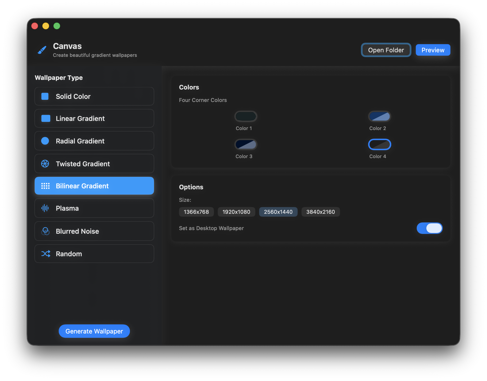

# Canvas - Gradient Wallpaper Generator

<p align="left">
  
  
  
</p>

A beautiful **macOS native app** and `bash` script to generate and apply different types of **gradient** & **blurred** wallpapers with a modern SwiftUI interface.

> **Based on the original [Canvas](https://github.com/adi1090x/canvas) script by [Aditya Shakya (@adi1090x)](https://github.com/adi1090x)**

<p align="center">
  
</p>



## 🖥️ macOS Native App

Canvas now includes a native macOS application with:
- **Modern SwiftUI interface** with glass effect sidebar
- **Real-time color picker** for all gradient types
- **Button-based size selection** (1366x768, 1920x1080, 2560x1440, 3840x2160)
- **Live wallpaper preview** and instant desktop application
- **macOS 26+ icon support** with Light, Dark, Clear, and Tinted variants
- **Left-aligned UI** optimized for macOS design guidelines

## ✨ Features

### Wallpaper Types:
- **Solid Color** - Single color backgrounds
- **Linear Gradient** - Smooth color transitions with adjustable angle
- **Radial Gradient** - Circular color transitions with shape options
- **Twisted Gradient** - Swirled gradient effects with twist control
- **Bilinear Gradient** - Four-corner color blending
- **Plasma** - Colorful abstract patterns
- **Blurred Noise** - Random textured backgrounds with blur control
- **Random** - Surprise wallpapers with random effects

### macOS App Features:
- **Intuitive Interface** - Modern SwiftUI design with glass effects
- **Live Color Picking** - Real-time color selection for all gradient types
- **Instant Preview** - See your wallpaper before applying
- **Multiple Resolutions** - Support for common display sizes
- **Auto-Apply** - Automatically set as desktop wallpaper
- **Native Integration** - Proper macOS app bundle with custom icons

## 📋 Requirements

### For macOS App:
- **macOS 14.0+** (Sonoma or later)
- **Xcode Command Line Tools** (for building)
- **ImageMagick** (for wallpaper generation)

### For Command Line Tool:
- `imagemagick`
- `feh` (Linux)
- `xcolor` (Linux)
- `xrandr` (Linux/XFCE only)

### Install ImageMagick:
```bash
# macOS (Homebrew)
brew install imagemagick

# Ubuntu/Debian
sudo apt install imagemagick

# Arch Linux
sudo pacman -S imagemagick
```

## 🚀 Installation

### macOS Native App

1. **Clone the repository:**
```bash
git clone https://github.com/yourusername/canvas.git
cd canvas
```

2. **Build the macOS app:**
```bash
./build_macos_app.sh
```

3. **Install to Applications folder:**
```bash
cp -R Canvas.app /Applications/
```

### Command Line Tool

1. **Make the script executable:**
```bash
chmod +x canvas

# Optional: Install system-wide
sudo cp canvas /usr/local/bin
```

2. **Run the program:**
```
$ ./canvas -h

┏━╸┏━┓┏┓╻╻ ╻┏━┓┏━┓
┃  ┣━┫┃┗┫┃┏┛┣━┫┗━┓
┗━╸╹ ╹╹ ╹┗┛ ╹ ╹┗━┛
Canvas V3.0  : The Wallpaper Generator.
Developed By : Aditya Shakya (@adi1090x)

Usage : canvas [-h] [-S wxh] [-B] [-s] [-l] [-r] [-t] [-b] [-p] [-n] [-a] [-R]

Options:
   -h   --help		    Show this help message & exit
   -S   --size		    Size of the wallpaper (default is 1366x768)
   -B   --blurred	    Generate a random blurred wallpaper
   -s   --solid		    Generate a solid color wallpaper
   -l   --linear	    Generate a linear gradient wallpaper
   -r   --radial	    Generate a radial gradient wallpaper
   -t   --twisted	    Generate a twisted gradient wallpaper
   -b   --bilinear	  Generate a bilinear(4point) gradient wallpaper
   -p   --plasma	    Generate a plasma wallpaper
   -n   --no-preview	Do not show preview when image is generated 
   -a   --autobg	    Automatically set as wallpaper (implies -n)
   -R   --randomize	  Generate a random wallpaper
```

## 🎨 Usage Examples

### macOS App
Simply launch Canvas.app and use the intuitive interface to:
1. Select a wallpaper type from the sidebar
2. Choose colors using the color pickers
3. Adjust parameters (angle, blur, twist) with sliders
4. Click "Generate Wallpaper" to create and preview
5. Set as desktop wallpaper with one click

### Command Line Examples

**Generate a solid color wallpaper:**
```bash
$ canvas -s
Pick Colors or Enter Colors or fetch from .Xresources file? (p/e/x): e
Enter the color name or hex (eg: teal, #EBCB8B): #A3BE8C
Set as desktop background? (y/n): y
```

**Generate a linear gradient:**
```bash
$ canvas -l
Pick Colors or Enter Colors or fetch from .Xresources file? (p/e/x): e
Enter the colors name or hex (format: color1-color2): orange-purple
Enter the rotation angle (default is 0): 90
Set as desktop background? (y/n): y
```

**Generate a twisted gradient:**
```bash
$ canvas -t
Pick Colors or Enter Colors or fetch from .Xresources file? (p/e/x): e
Enter the colors name or hex (format: color1-color2): blue-pink
Enter the twisting amount (maximum 500): 180
Set as desktop background? (y/n): y
```

## 🖼️ Gallery

|Solid Color|Linear Gradient|Radial Gradient|
|-|-|-|
||||

|Twisted Gradient|Bilinear Gradient|Plasma|
|-|-|-|
||||

## 🔧 Building from Source

### Prerequisites
- Xcode Command Line Tools: `xcode-select --install`
- ImageMagick: `brew install imagemagick`

### Build Steps
```bash
# Clone the repository
git clone https://github.com/yourusername/canvas.git
cd canvas

# Build the macOS app
./build_macos_app.sh

# The Canvas.app will be created in the current directory
# Install to Applications folder (optional)
cp -R Canvas.app /Applications/
```

## 🐛 Troubleshooting

### Common Issues

1. **Wallpaper not changing on macOS**: 
   - Ensure you have proper permissions for Desktop & Screen Saver in System Preferences > Security & Privacy

2. **Build fails with Swift errors**:
   - Make sure you have Xcode Command Line Tools installed: `xcode-select --install`
   - Verify macOS version is 14.0 or later

3. **ImageMagick not found**:
   - Install via Homebrew: `brew install imagemagick`
   - Or download from: https://imagemagick.org/script/download.php#macosx

4. **App icon appears oversized**:
   - This is resolved in the latest build with proper icon sizing

## 📄 License

This project is licensed under the GNU General Public License v3.0 - see the [LICENSE](LICENSE) file for details.

As this project is based on the original Canvas script by Aditya Shakya, which is licensed under GPL v3, this derivative work maintains the same license to comply with GPL requirements.

## 🙏 Acknowledgments

- **Original Canvas script** by [Aditya Shakya (@adi1090x)](https://github.com/adi1090x/canvas)
- macOS native app implementation with SwiftUI
- Custom app icons with macOS 26+ appearance support

## 📜 Attribution

This project is based on the original [Canvas wallpaper generator](https://github.com/adi1090x/canvas) by Aditya Shakya. The core wallpaper generation functionality and command-line interface are derived from his work. This macOS native app adds a modern SwiftUI interface while preserving the original script's capabilities.

## 🤝 Contributing

Contributions are welcome! Please feel free to submit a Pull Request.

1. Fork the project
2. Create your feature branch (`git checkout -b feature/AmazingFeature`)
3. Commit your changes (`git commit -m 'Add some AmazingFeature'`)
4. Push to the branch (`git push origin feature/AmazingFeature`)
5. Open a Pull Request