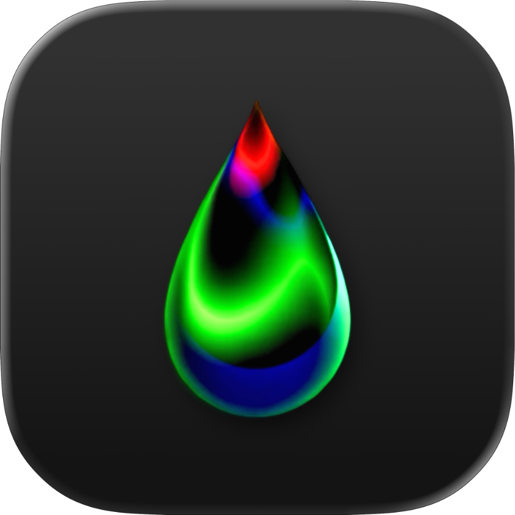

# Canvas - Gradient Wallpaper Generator

<p align="left">
  
  
  
</p>

A **macOS native app** and `bash` script to generate gradient & blurred wallpapers with a modern SwiftUI interface.

> **Based on the original [Canvas](https://github.com/adi1090x/canvas) script by [Aditya Shakya (@adi1090x)](https://github.com/adi1090x)**

<p align="center">
  
</p>

## ✨ Features

### Wallpaper Types:
- **Solid Color** - Single color backgrounds
- **Linear Gradient** - Color transitions with adjustable angle
- **Radial Gradient** - Circular color transitions
- **Twisted Gradient** - Swirled gradient effects
- **Bilinear Gradient** - Four-corner color blending
- **Plasma** - Colorful abstract patterns
- **Blurred Noise** - Random textured backgrounds
- **Random** - Surprise wallpapers

### App Features:
- Modern SwiftUI interface with glass effects
- Real-time color picker
- Button-based size selection (1366x768, 1920x1080, 2560x1440, 3840x2160)
- Live wallpaper preview
- Auto-apply to desktop
- macOS 26+ icon support

## 📋 Requirements

- **macOS 14.0+** (Sonoma or later)
- **ImageMagick** - Install via `brew install imagemagick`

## 🚀 Installation

1. **Clone and build:**
```bash
git clone https://github.com/yourusername/canvas.git
cd canvas
./build_macos_app.sh
cp -R Canvas.app /Applications/
```

2. **Usage:**
   - Launch Canvas.app
   - Select wallpaper type
   - Choose colors
   - Click "Generate Wallpaper"

## 🖼️ Gallery

|Solid Color|Linear Gradient|Radial Gradient|
|-|-|-|
||||

|Twisted Gradient|Bilinear Gradient|Plasma|
|-|-|-|
||||

## 📄 License

GNU General Public License v3.0 - see [LICENSE](LICENSE) file.

## 🙏 Attribution

Based on the original [Canvas wallpaper generator](https://github.com/adi1090x/canvas) by Aditya Shakya. This macOS app adds a SwiftUI interface while preserving the original functionality.